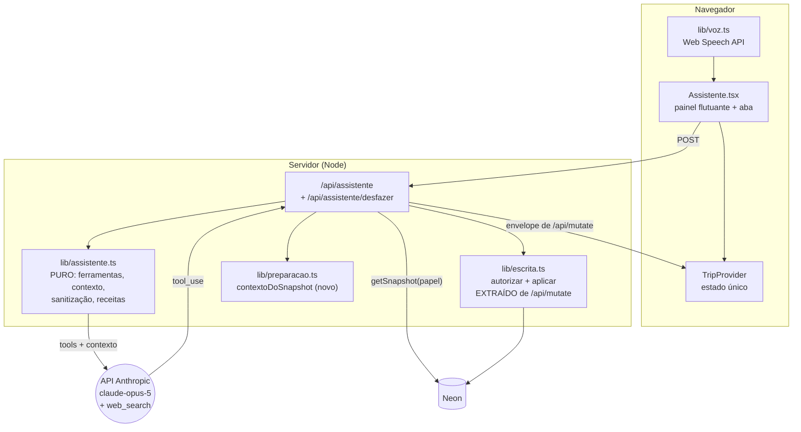

# Assistente de IA Design

**Spec**: `.specs/features/assistente-ia/spec.md`
**Status**: Draft — aguardando aprovação

---

## Três achados que mudam o design

### 1. O `change_log` não consegue desfazer uma remoção

`registrarAlteracao` (`lib/db.ts:744`) grava `campo`, `de`, `para` como **texto**. No caminho de remoção (`app/api/mutate/route.ts`), a chamada é literalmente:

```ts
await registrarAlteracao(tripId, acesso.participanteId, op.entidade, op.id,
                         '(registro)', 'existia', 'removido')
```

O conteúdo da linha apagada não é guardado em lugar nenhum. Some junto com ela — e junto com os filhos que o `on delete cascade` leva (um `roteiro` removido leva as `itinerary_options` dele; um `voo` leva as `flight_stops`).

Isso colide de frente com o P1-6 ("desfazer o lote inteiro"). Com escrita direta e **sem** tela de confirmação, uma frase mal reconhecida pela voz — "apaga o jantar de ontem" saindo de "paga o jantar de ontem" — destrói dado sem volta.

**Decisão: no v1 o assistente cria e edita, e não remove.** Remover continua sendo ação de tela, onde já existe `ConfirmarDialogo` e o gesto é deliberado. Isso mantém o desfazer **total**, que é o que torna "escreve direto" seguro.

Isto estreita o "todas as features do app" que o usuário pediu, e a troca é consciente: o valor está em *alimentar* a viagem sem formulário, não em esvaziá-la por voz. Caminho de upgrade, se incomodar: uma coluna `registro jsonb` no `change_log` preenchida só na remoção, mais a captura dos filhos do cascade — aí a remoção volta com desfazer honesto.

### 2. O motor de preparação está preso dentro do componente

`montarPreparacao(c: Contexto)` é puro e testado, mas o `Contexto` que ele recebe é montado **dentro** de um `useMemo` em `components/tabs/Preparacao.tsx:102-185`. O servidor não tem como chamar aquilo.

O P5-1 exige que o assistente derive as pendências desse módulo em vez de recalcular. Então o design extrai a montagem para `lib/preparacao.ts`:

```ts
export function contextoDoSnapshot(s: Snapshot, eu: string, admin: boolean, hoje: Date): Contexto
```

A aba passa a chamar a mesma função. Ganho além do assistente: hoje existe **uma** montagem de `Contexto`, no cliente; se o servidor fizesse a sua, seriam duas listas de pendências divergindo em silêncio — o mesmo erro que o README documenta entre `/api/mutate` e `/api/snapshot` ("They drifted once and every write crashed the next render").

### 3. `getSnapshot` já é a história inteira de privacidade

`getSnapshot(tripId, papel, participanteId)` (`lib/db.ts:291`) já embute `financeiroDaViagem` (que devolve `{admin:false, obrigacoes}` para `visualizador`, com o SQL excluindo despesa alheia) e `documentosDaViagem` (que exclui documento `pessoal` de terceiro).

Portanto o IA-01 não é trabalho novo: é a **proibição** de escrever query própria para o assistente. O contexto do modelo é o snapshot daquela pessoa, e o recorte vem de graça. Uma query nova "só para a IA ver a viagem toda" reabriria todos os vazamentos que essas duas funções fecham.

---

## Arquitetura



**A regra que rege o desenho:** a rota do assistente não sabe escrever. Ela traduz linguagem em `Operacao[]` e entrega para o mesmo código que `/api/mutate` usa. Se ela soubesse escrever sozinha, existiriam dois lugares decidindo quem pode o quê — e um deles ficaria para trás.

---

## Módulos

| Arquivo | Novo? | Responsabilidade |
| --- | --- | --- |
| `lib/assistente.ts` | novo | **Puro.** Ferramentas a partir do zod, digest da viagem, sanitização anti-vazamento, receitas de prompt, tradução `tool_use` → `Operacao`. Zero I/O, zero SDK. |
| `lib/assistente.test.ts` | novo | Testes do acima. Segue `node --test`, sem framework. |
| `lib/escrita.ts` | novo (extração) | `autorizar`, `aplicar`, `recorte`, `conferirPai`, `gravarDespesa`, `TABELA` — **movidos** de `app/api/mutate/route.ts`, sem mudança de comportamento. As duas rotas passam a importar daqui. |
| `lib/voz.ts` | novo | Casca do Web Speech API em pt-BR, com detecção de suporte. ~40 linhas. |
| `app/api/assistente/route.ts` | novo | A rota. Sessão, limite, chamada ao modelo, aplicação do lote, envelope. |
| `app/api/assistente/desfazer/route.ts` | novo | Replay reverso de um lote do `change_log`. |
| `components/Assistente.tsx` | novo | Painel, histórico, cartões de resultado, botão de voz, desfazer. |
| `components/tabs/Assistente.tsx` | novo | Casca fina: a aba dedicada monta o mesmo componente. |
| `app/api/mutate/route.ts` | alterado | Passa a importar de `lib/escrita.ts`. Nenhuma regra muda. |
| `lib/preparacao.ts` | alterado | Ganha `contextoDoSnapshot`. |
| `components/tabs/Preparacao.tsx` | alterado | Passa a usar `contextoDoSnapshot` em vez do `useMemo` inline. |
| `components/Shell.tsx` | alterado | Aba `assistente` + botão flutuante. |
| `db/schema.sql` | alterado | `change_log` ganha `origem` e `lote` (bloco `create` **e** seção de migrações). |
| `config/site.ts` | alterado | Nome e frases do assistente. Nenhuma string de produto em componente. |
| `lib/offline.ts` | alterado | `VERSAO` 6 → 7. |

---

## O contrato da rota

```
POST /api/assistente
{ trip_id, mensagens: [{papel:'pessoa'|'assistente', texto}], aba?, receita?, alvo_id? }

200
{ texto, fontes: [{titulo, url}], lote: string|null,
  aplicadas: number, rejeitadas: [{motivo}],
  snapshot, eu: {userId, usuario, participanteId, papel} }
```

`snapshot` + `eu` são **o mesmo envelope de `/api/mutate`**. O README registra que os dois já divergiram uma vez e "every write crashed the next render"; a rota nova nasce com o envelope idêntico e um teste que compara as chaves das duas respostas.

`POST /api/assistente/desfazer { trip_id, lote }` → mesmo envelope.

---

## As ferramentas da IA

Derivadas de `POR_ENTIDADE` em `lib/schema.ts`, via `z.toJSONSchema()` do zod 4 (verificado nesta versão: `zod@4.4.3` expõe `toJSONSchema`). Uma ferramenta por entidade escrevível, com `strict: true` e `additionalProperties: false`.

```ts
// lib/assistente.ts
export function ferramentas(papel: Papel): Ferramenta[]
```

Duas propriedades que isso compra:

- **A lista de campos não é copiada.** Adicionar um campo hoje já exige tocar `db/schema.sql`, `lib/schema.ts`, `/api/export` e `lib/importar.ts` juntos (CLAUDE.md). Um quinto lugar com a lista à mão seria o que ninguém atualiza — e o sintoma seria a IA parar de preencher um campo novo, em silêncio.
- **O papel decide a lista.** `ferramentas('visualizador')` devolve só o que aquele papel escreve (`checklist_state`, `entrega`, documento próprio). O modelo não recebe sequer a descrição de uma ferramenta que ele não poderia usar — menos chance de tentar, menos recusa para explicar.

`autorizar` continua sendo a barreira real (P1-2/3): a lista por papel é ergonomia, não segurança.

### Configuração do modelo

| Parâmetro | Valor | Razão |
| --- | --- | --- |
| `model` | `claude-opus-5` | Padrão da referência da API. |
| `thinking` | `{type:'adaptive'}` | Traduzir "jantar amanhã 20h dividido entre todos" em despesa + divisão + item de roteiro é raciocínio, não extração. |
| `output_config.effort` | `high` na conversa, `medium` no resumo de lugar, `low` na sugestão proativa | A proativa lê uma lista pronta de `montarPreparacao`; não precisa pensar. |
| `max_tokens` | `16000` | Padrão para não-streaming, abaixo do timeout do SDK. |
| `tools` | entidades + `web_search_20260209` | A variante com filtragem dinâmica, suportada no Opus 5. |
| streaming | não | Ver spec → Out of Scope. |

### Cache de prompt

A ordem de renderização é `tools` → `system` → `messages`. O prompt do sistema e as ferramentas são **estáveis por papel**; o digest da viagem muda a cada mensagem. Então:

- `system` (regras, tom, data de hoje **não** incluída aqui) + `tools` → prefixo cacheável, com `cache_control` no fim do `system`.
- digest da viagem e conversa → primeira mensagem `user` em diante, **depois** do breakpoint.

Colocar o digest no `system` (o lugar intuitivo) invalidaria o cache a cada escrita, porque o snapshot muda. `usage.cache_read_input_tokens` zerado em requisições seguidas é o sintoma a vigiar.

---

## Segurança

| Requisito | Mecanismo |
| --- | --- |
| IA-01 — contexto recortado | `getSnapshot(tripId, acesso.papel, acesso.participanteId)`. Proibido `sql` direto na rota do assistente; o lint do próprio review checa isso. |
| IA-02 — escrita autorizada | `lib/escrita.ts` com o `Acesso` da sessão. Mesmo código de `/api/mutate`. |
| IA-14 — dado pessoal não vai para a web | `sanitizarParaWeb()` em `lib/assistente.ts`: o digest tem **duas** formas. A que vai no contexto do modelo tem os dados da pessoa; a instrução do sistema proíbe repetir número de documento, telefone, e-mail ou localizador dentro de uma busca. Reforço estrutural: o digest **omite** por completo `documents.valor` e `travelers.passaporte` do texto — a IA sabe que o passaporte existe e está vencendo, não o número dele. |
| IA-08b — injeção de prompt | O digest marca conteúdo de usuário como dado (delimitado e rotulado), e o sistema instrui a nunca obedecer instrução vinda dali. A defesa real continua sendo `autorizar`: no pior caso a injeção faz o que a própria pessoa já podia fazer, e fica no `change_log` com `origem='assistente'`, desfazível. |
| Chave | `ANTHROPIC_API_KEY` lida em `app/api/assistente/route.ts`, `runtime = 'nodejs'`. Nunca em componente cliente, nunca em `NEXT_PUBLIC_*`. |

---

## Mudança de schema

```sql
-- no bloco create de change_log
origem  text not null default 'pessoa' check (origem in ('pessoa','assistente')),
lote    text,

-- e TAMBÉM na seção de migrações (banco em uso não vê o create):
alter table change_log add column if not exists origem text not null default 'pessoa';
alter table change_log add column if not exists lote   text;
alter table change_log drop constraint if exists change_log_origem_check;
alter table change_log add  constraint change_log_origem_check
  check (origem in ('pessoa','assistente')) not valid;
create index if not exists idx_change_log_lote on change_log (trip_id, lote);
```

Duas armadilhas do CLAUDE.md respeitadas de propósito: a coluna entra **nos dois lugares** (só no `create` ela não existiria em nenhum banco real), e o `check` entra como `not valid` — mas aqui isso é seguro porque o `default 'pessoa'` já satisfaz toda linha existente.

`registrarAlteracao` ganha dois parâmetros opcionais no fim (`origem`, `lote`), então as 7 chamadas existentes seguem compilando sem edição.

---

## Custo e limite

Uma chave para cinco pessoas sem teto é uma conta aberta. Reusa `registrarFalha` de `lib/session.ts` com namespace próprio:

```ts
LIMITES_ASSISTENTE = { limite: 30, janelaMs: 60*60*1000, bloqueioMs: 15*60*1000 }
// chave: `assistente:${userId}` — por CONTA, não por IP: cinco pessoas na
// mesma rede do hotel dividiriam um balde só se fosse por IP.
```

Herda o teto conhecido do limitador (contador em memória, uma janela por instância) e o mesmo comentário `ponytail:`. Aqui o custo de furar é dinheiro, não segurança.

---

## Testing strategy

`lib/assistente.ts` é puro justamente para caber em `node --test` sem navegador nem rede:

| Teste | O que trava |
| --- | --- |
| `ferramentas('visualizador')` não contém `roteiro`, `voo`, `custo` | Regressão de papel na lista de ferramentas |
| `ferramentas('editor')` bate com as chaves de `POR_ENTIDADE` menos as proibidas | Entidade nova aparecendo sem querer |
| Toda ferramenta tem `strict:true` e `additionalProperties:false` | Contrato de tool use |
| `digest()` não contém passaporte, telefone, e-mail nem `documents.valor` | IA-14 |
| `digest()` de `visualizador` não contém total da viagem | IA-01 |
| `paraOperacoes()` rejeita entidade fora da lista e `op:'remover'` | Achado 1 |
| Chaves do envelope do assistente == chaves do envelope de `/api/mutate` | A divergência que o README já documenta |

Os limites de autorização de verdade (`autorizar` recusando por papel) continuam sem teste automatizado, como o resto do repo — mas agora a função é importável de `lib/escrita.ts` em vez de estar presa numa rota, o que é pré-requisito para testá-la depois.

---

## Risks & Concerns

| Risco | Avaliação |
| --- | --- |
| **A extração de `/api/mutate` para `lib/escrita.ts` é a mudança mais perigosa da feature** | Ela toca o caminho de escrita de todo o app. Deve ser um commit próprio, sem nenhuma alteração de comportamento, com `npm test` e `npm run build` verdes antes de qualquer linha de IA ser escrita. Se algo quebrar depois, o `git bisect` distingue "a extração quebrou" de "o assistente quebrou". |
| **O modelo inventar um `id`** | `autorizar`/`recorte` recortam por `trip_id`; um id inventado não encontra linha e a operação vira `rejeitada`. Falha alto, não em silêncio. |
| **Custo real desconhecido** | Nenhuma medição existe. O digest de uma viagem de 5 pessoas precisa ser medido com `messages.countTokens` antes do primeiro deploy — se passar de alguns milhares de tokens por mensagem, o cache vira obrigatório, não otimização. |
| **`web_search` roda nos servidores da Anthropic** | A consulta sai do nosso controle. Por isso o digest omite estruturalmente o dado sensível (IA-14) em vez de confiar só na instrução. |
| ~~`ocorre_em` volta do snapshot com `Z` e milissegundos~~ — **risco descartado** | O `design.md` do checklist registrou este bug como aberto (`parseData` devolvendo `null` em silêncio, afetando o app inteiro). Ele **já foi corrigido**: `lib/db.ts:327` seleciona `to_char(ocorre_em, 'YYYY-MM-DD"T"HH24:MI:SS')`, o mesmo tratamento de `itinerary_days.dia`. Verificado nesta leitura; o digest do assistente lê horário do roteiro sem risco. Vale corrigir o registro antigo. |
| **Aba nova numa barra que já está cheia** | O `Shell` já resolve onze abas com quatro fixas + painel "Mais". A aba `assistente` entra no "Mais"; o acesso rápido no celular é o botão flutuante, não a barra. |

---

## Ordem de implementação

1. **Extração** `lib/escrita.ts` — sem comportamento novo, testes verdes. *(commit isolado)*
2. **Schema** `change_log.origem`/`lote` + `registrarAlteracao` + `VERSAO` 7.
3. **Motor puro** `lib/assistente.ts` + testes. Nada de rede ainda.
4. **Rota** `/api/assistente` + desfazer. P1 fechado e testável por `curl`.
5. **Painel** `components/Assistente.tsx` + botão flutuante + aba. P2 (menos voz).
6. **Voz** `lib/voz.ts`. P2 completo.
7. **Receitas** resumo de lugar + planejar dia. P3.
8. **Web search** + fontes. P4.
9. **Proativo** `contextoDoSnapshot` + sugestões. P5.

Os passos 1 e 2 não dependem da chave da Anthropic e podem ser revisados antes de qualquer custo ser gerado.
