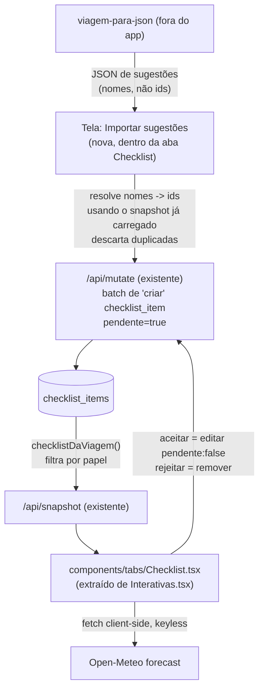

# Checklist Inteligente Design

**Spec**: `.specs/features/checklist-inteligente/spec.md`
**Status**: Approved

---

## Achado que muda o design: o gap de privacidade já existe hoje

Lendo `lib/db.ts:337` e `components/tabs/Interativas.tsx`, o `escopo: 'pessoal'` **não restringe nada agora** — a query do snapshot (`select * from checklist_items where trip_id = ...`) não filtra por participante, e a tela só separa "Da viagem" / "Seus" visualmente. Qualquer item pessoal já vai, hoje, para o dispositivo de todo mundo. CHK-02/03 não são só uma feature nova: fecham um vazamento que existe assim que alguém criar um item pessoal de verdade (remédio, número de documento). Isso sobe a prioridade de P1 dentro do próprio P1.

Achado equivalente sobre "vínculo por dia": o README já documenta, em `## The itinerary, day by day`, que o checklist do dia reusa `prazo_ideal`/`prazo_maximo` deliberadamente, para não criar "um segundo sistema de tarefas por dia" que desincroniza do checklist principal. Este design segue a mesma regra — nenhuma coluna `dia` nova.

---

## Estrutura da skill — decisão confirmada (as 6 pastas)

O usuário confirmou explicitamente a árvore `schema/rules/templates/mappings/validators/changelog/` pedida no brief original, mesmo sabendo que `reference/`+`scripts/` já existem. Para não duplicar a mesma informação em dois lugares, a árvore nova é **escopada só à capacidade nova** (sugestões de checklist + versionamento), enquanto `reference/formato.md` continua sendo a fonte para o que já existia (roteiro/voos/hospedagens/checklist manual):

```
.claude/skills/viagem-para-json/
├── SKILL.md                              ← + front-matter skillVersion/schemaVersion
├── CHANGELOG.md                          ← (fora das pastas — raiz da skill, um arquivo só)
├── reference/                            ← formato.md existente, intocado
├── scripts/                              ← extrair.mjs, validar.mjs existentes, intocados
├── schema/
│   └── checklist-sugestoes.schema.json   ← espelho legível do ChecklistSugestoesBatchSchema
│                                            (lib/schema.ts continua sendo quem manda, comentário
│                                            no topo do arquivo lembra isso — mesma regra que já
│                                            existe em SKILL.md: "o schema vence a documentação")
├── rules/
│   └── dedup-e-prioridade.md             ← normalização de título, quando é obrigatório/opcional,
│                                            regra de "pessoal exige dono", regra de fonte+data
├── templates/
│   └── categorias-e-fases.md             ← lista de categorias sugeridas, enum de prioridade,
│                                            como a fase da viagem é calculada (não armazenada)
├── mappings/
│   └── campo-para-app.md                 ← nome → id (assigned_to_nomes, evento/voo/cruzeiro por
│                                            nome), mesmo padrão que reserva/documento já usam
└── validators/
    └── validar-sugestoes.mjs             ← novo script irmão de scripts/validar.mjs, mas só
                                              para lotes de sugestão (ChecklistSugestoesBatchSchema)
```

`schema/checklist-sugestoes.schema.json` é o único ponto de risco real de duplicação (dois lugares descrevendo o mesmo formato) — mitigado com um comentário explícito no topo do arquivo apontando `lib/schema.ts` como fonte, e o próprio `validators/validar-sugestoes.mjs` validando contra o zod real, não contra esse JSON Schema (o JSON Schema é só leitura humana/tooling, não é usado em runtime). Registrado em Risks & Concerns.

---

## Architecture Overview



---

## Code Reuse Analysis

### Existing Components to Leverage

| Component | Location | How to Use |
| --- | --- | --- |
| `ChecklistItemSchema` | `lib/schema.ts:366` | Estender com campos novos, todos opcionais/`.default()` — não quebra dados existentes |
| `POR_ENTIDADE.checklist_item = ChecklistItemSchema.partial()` | `lib/schema.ts:699` | Já aceita edição parcial — nenhuma mudança de código, só de schema |
| `TABELA.checklist_item` (`via:'trip'`, `minimo:'editor'`) | `app/api/mutate/route.ts:53` | Reusado sem alteração para criar/editar/aceitar/rejeitar |
| `/api/mutate` batch de `criar` | `app/api/mutate/route.ts` | Import de sugestões vira um lote de `criar`, sem rota nova |
| `financeiroDaViagem` (padrão "papel decide a query") | `lib/db.ts:403` | Mesmo princípio para `checklistDaViagem` — decidir no SQL, não filtrar depois de buscar |
| `parseData`, `diasAte`, `numeroDoDia` | `lib/derive.ts` | Base de `faseChecklist()` — sem reescrever matemática de data |
| `Evento.dicas` (já existe) | `lib/schema.ts:231` | Painel de dicas (P3) é leitura direta, zero coluna nova |
| `places.lat/lon` (já existe) | `db/schema.sql` (`places`) | Clima usa essas coordenadas — zero geocoding novo |
| `EditorSheet` (`campo.tipo` switch) | `components/EditorSheet.tsx:660` | Ganha um tipo `'multiopcao'` novo, reusável por qualquer entidade futura com lista de participantes |
| `reserva`/`documento` por nome, não por id | `lib/schema.ts:236-245` (`EventoSchema`) | Precedente direto para resolver nome → id na importação de sugestões |
| `AdminAcoes`, `Titulo`, `Progresso`, `Cartao`, `Vazio` | `components/ui.tsx` | Reusados tal como estão na tela nova |

### Integration Points

| System | Integration Method |
| --- | --- |
| `/api/snapshot` | `checklistDaViagem()` substitui a query crua em `getSnapshot` (`lib/db.ts:337`) |
| `/api/mutate` | Sem rota nova — sugestões entram como lote de `criar`; aceitar/rejeitar são `editar`/`remover` já suportados |
| `/api/export` + `lib/importar.ts` | Novas colunas incluídas no round-trip (checklist do backup completo) |
| Open-Meteo | `fetch` direto do cliente, sem chave, sem rota de servidor nova |
| Skill `viagem-para-json` | `reference/checklist-sugestoes.md` novo + `validar.mjs` valida contra `ChecklistSugestoesBatchSchema` |

---

## Components

### `lib/schema.ts` — extensão de `ChecklistItemSchema` + schema de sugestão

- **Purpose**: Contrato único do item de checklist (DB) e do lote de sugestões (wire format da skill).
- **Location**: `lib/schema.ts`
- **Interfaces**:
  - `ChecklistItemSchema` ganha: `assigned_to: z.array(Id).default([])`, `prioridade: z.enum([...]).default('importante')`, `pais/cidade: TextoOpc`, `itinerary_event_id/flight_id/cruise_id: Id.nullish()`, `pendente: z.boolean().default(false)`, `fonte_tipo: z.enum(['documento','pesquisa','sugestao','manual']).nullish()`, `fonte_detalhe: TextoOpc`, `fonte_consultado_em: Data.nullish()`
  - `ChecklistSugestaoSchema` (novo, só para o wire format) — mesmos campos de conteúdo, mas `assigned_to_nomes: z.array(Texto)`, `evento/voo/cruzeiro` por nome (mesmo padrão de `EventoSchema.reserva`)
  - `ChecklistSugestoesBatchSchema = z.object({ viagem: Texto, gerado_em: Data, sugestoes: z.array(ChecklistSugestaoSchema) })`
- **Dependencies**: nenhuma nova
- **Reuses**: `Id`, `Texto`, `TextoOpc`, `Data` já definidos no topo do arquivo

### `db/schema.sql` — migração idempotente

- **Purpose**: Colunas novas em `checklist_items`, com `alter table ... add column if not exists` na seção de migrações (README exige as duas: create block **e** migração).
- **Location**: `db/schema.sql`
- **Interfaces**: colunas listadas em Data Models abaixo
- **Dependencies**: nenhuma
- **Reuses**: convenção existente (`text primary key default gen_random_uuid()::text`, `check (... in (...))` para enums)

### `lib/db.ts` — `checklistDaViagem`

- **Purpose**: Aplicar a regra de privacidade no SQL, não depois de buscar.
- **Location**: `lib/db.ts`, substitui a query em `getSnapshot` (linha 337)
- **Interfaces**: `checklistDaViagem(tripId: string, papel: Papel, participanteId: string): Promise<ChecklistItem[]>`
- **Dependencies**: `papelAlcanca` (já importado em `db.ts` via `config/navigation.ts`)
- **Reuses**: o princípio de `financeiroDaViagem`, adaptado — aqui é uma query com `WHERE` condicional por papel, não duas queries de formato diferente, porque a *forma* da linha não muda, só a contagem

### `lib/checklist.ts` (novo, pequeno, no estilo `derive.ts`)

- **Purpose**: Funções puras de resolução/dedup de sugestões — testáveis sem rede nem banco.
- **Location**: `lib/checklist.ts` + `lib/checklist.test.ts`
- **Interfaces**:
  - `normalizarTitulo(titulo: string): string` — minúsculo, sem acento, trim
  - `resolverSugestoes(sugestoes: ChecklistSugestao[], snapshot: Snapshot): { validas: ChecklistItemCriar[]; erros: { sugestao: ChecklistSugestao; motivo: string }[] }` — resolve nomes → ids contra participantes/roteiro/voos/cruzeiros já carregados, aplica dedup normalizado contra `snapshot.checklist`, rejeita conforme CHK-18/19
- **Dependencies**: nenhuma (puro)
- **Reuses**: `Fase`/`diasAte` de `derive.ts` para computar `faseChecklist` no mesmo arquivo ou vizinho (ver Data Models)

### `components/EditorSheet.tsx` — novo tipo de campo `'multiopcao'`

- **Purpose**: Seleção múltipla de participantes (para `assigned_to`) sem widget bespoke.
- **Location**: `components/EditorSheet.tsx` (~linha 660, mesmo switch de `campo.tipo`)
- **Interfaces**: `campo.tipo === 'multiopcao'` renderiza checkboxes a partir de `campo.opcoes` ou `useOpcoesDaFonte(campo.fonte)`, valor é `string[]`
- **Dependencies**: nenhuma nova
- **Reuses**: o mesmo `useOpcoesDaFonte` que já resolve opções dinâmicas para o tipo `'opcao'`

### `components/tabs/Checklist.tsx` (novo — extraído de `Interativas.tsx`)

- **Purpose**: A tela redesenhada — visões por categoria/pessoa/destino/tudo, progresso, dicas, clima, revisão de sugestões.
- **Location**: `components/tabs/Checklist.tsx`; `Interativas.tsx` perde a função `Checklist` e mantém só `Emergência`
- **Interfaces**: `export function Checklist()` (mesma assinatura de hoje — `Shell.tsx` já aponta o `AbaId: 'checklist'` para essa exportação, sem mudança de wiring)
- **Dependencies**: `useTrip()`, `progressoChecklist`/`faseChecklist` de `derive.ts`, `resolverSugestoes` de `checklist.ts`
- **Reuses**: `AdminAcoes`, `Titulo`, `Progresso`, `Cartao`, `Secao`, `Vazio` de `ui.tsx`; `EditorSheet` para criar/editar item

### Clima (client-side, sem rota nova)

- **Purpose**: Painel "Clima nos próximos destinos", só quando houver dado.
- **Location**: função pequena dentro de `components/tabs/Checklist.tsx` (ou `lib/clima.ts` se passar de ~20 linhas)
- **Interfaces**: `buscarClima(lat: number, lon: number): Promise<{ dia: string; tempMin: number; tempMax: number; codigo: number }[] | null>` — `null` em qualquer falha, painel some
- **Dependencies**: Open-Meteo (`api.open-meteo.com/v1/forecast`), sem chave — uso não-comercial, até 16 dias, 10k chamadas/dia. [Open-Meteo pricing](https://open-meteo.com/en/pricing)
- **Reuses**: `places.lat/lon` já existente; nenhuma cidade sem coordenada aparece no painel (mesma regra que já vale para o mapa)

### Skill `viagem-para-json` (extensão versionada, árvore de 6 pastas)

- **Purpose**: Emitir sugestões de checklist no formato `ChecklistSugestoesBatchSchema`, com a skill preparada para evoluir de forma controlada.
- **Location**: ver árvore completa acima — `SKILL.md` (front-matter), `CHANGELOG.md`, `schema/checklist-sugestoes.schema.json`, `rules/dedup-e-prioridade.md`, `templates/categorias-e-fases.md`, `mappings/campo-para-app.md`, `validators/validar-sugestoes.mjs`
- **Dependencies**: nenhuma
- **Reuses**: o processo de 6 passos já documentado (extrair → ler tudo → reconciliar → montar → validar → relatório) — sugestões seguem o mesmo processo, só muda o schema de saída; `reference/`+`scripts/` existentes ficam intocados, cobrindo só o que já cobriam

---

## Data Models

### `checklist_items` — colunas novas

```sql
alter table checklist_items add column if not exists assigned_to text[] not null default '{}';
alter table checklist_items add column if not exists prioridade text not null default 'importante'
  check (prioridade in ('obrigatorio','importante','recomendado','opcional'));
alter table checklist_items add column if not exists pais text;
alter table checklist_items add column if not exists cidade text;
alter table checklist_items add column if not exists itinerary_event_id text
  references itinerary_events(id) on delete set null;
alter table checklist_items add column if not exists flight_id text
  references flights(id) on delete set null;
alter table checklist_items add column if not exists cruise_id text
  references cruises(id) on delete set null;
alter table checklist_items add column if not exists pendente boolean not null default false;
alter table checklist_items add column if not exists fonte_tipo text
  check (fonte_tipo is null or fonte_tipo in ('documento','pesquisa','sugestao','manual'));
alter table checklist_items add column if not exists fonte_detalhe text;
alter table checklist_items add column if not exists fonte_consultado_em date;
alter table checklist_items add constraint checklist_pessoal_tem_dono
  check (escopo <> 'pessoal' or array_length(assigned_to, 1) > 0);
```

**Relationships**: `assigned_to` guarda `traveler_id`s (sem FK de array — validado na aplicação, mesmo trade-off que o resto do projeto aceita para não introduzir tabela de junção só para isto). `itinerary_event_id`/`flight_id`/`cruise_id` nullable — perder o vínculo nunca apaga o item (edge case do spec).

### TypeScript (via zod, não duplicado à mão)

```typescript
// lib/schema.ts — extensão, campos novos apenas
type Prioridade = 'obrigatorio' | 'importante' | 'recomendado' | 'opcional'
type FonteTipo = 'documento' | 'pesquisa' | 'sugestao' | 'manual'

interface ChecklistItem {
  // ...campos existentes...
  assigned_to: string[]
  prioridade: Prioridade
  pais?: string | null
  cidade?: string | null
  itinerary_event_id?: string | null
  flight_id?: string | null
  cruise_id?: string | null
  pendente: boolean
  fonte_tipo?: FonteTipo | null
  fonte_detalhe?: string | null
  fonte_consultado_em?: string | null
}

interface ChecklistSugestao {
  titulo: string
  categoria?: string
  escopo: 'global' | 'pessoal'
  assigned_to_nomes: string[]
  prioridade?: Prioridade
  pais?: string
  cidade?: string
  evento?: string  // nome do passeio/hospedagem no roteiro, resolvido a itinerary_event_id
  voo?: string      // "companhia numero" ou similar, resolvido a flight_id
  cruzeiro?: string // resolvido a cruise_id
  prazo_ideal?: string
  prazo_maximo?: string
  fonte_tipo: FonteTipo
  fonte_detalhe?: string
  fonte_consultado_em?: string
}
```

**Relationships**: `ChecklistSugestao` nunca é persistido como está — `resolverSugestoes` o transforma num `criar` de `ChecklistItem` com `pendente: true`, ou o descarta com um motivo.

---

## Error Handling Strategy

| Error Scenario | Handling | User Impact |
| --- | --- | --- |
| Sugestão com `assigned_to_nomes` que não bate com nenhum participante | `resolverSugestoes` retorna em `erros`, nada é criado para essa sugestão | Tela de importação lista o nome não resolvido, admin corrige ou ignora aquela sugestão |
| Sugestão `pessoal` sem `assigned_to_nomes` | Mesma via de erro acima | Idem |
| Sugestão duplicada (título normalizado já existe) | Descartada silenciosamente na resolução, contada num resumo ("3 duplicadas ignoradas") | Admin vê a contagem, não cada uma |
| `evento`/`voo`/`cruzeiro` citado não bate com nada do roteiro | Vínculo fica `null`, item é criado do mesmo jeito | Item de checklist sem contexto de roteiro, mas não perdido — só o link opcional falha, não a sugestão inteira |
| Open-Meteo fora do ar / timeout / cidade sem lat-lon | `buscarClima` retorna `null` | Painel de clima inteiro não renderiza — sem placeholder, sem erro visível |
| `visualizador`/`editor` tenta ver/editar item pessoal de terceiro via API direta | `checklistDaViagem` já não devolve a linha; `/api/mutate` aplicando `via:'trip'` mais o `minimo` de papel bloqueia edição — falta ainda o *dono* na checagem, ver Risks | 403 ou item simplesmente ausente, nunca um 200 com dado de terceiro |

---

## Risks & Concerns

| Concern | Location (file:line) | Impact | Mitigation |
| --- | --- | --- | --- |
| Vazamento de privacidade pré-existente: query do checklist não filtra por papel/dono hoje | `lib/db.ts:337` | Item `pessoal` já vaza para todo participante assim que alguém o usa para algo sensível | Corrigido por este próprio feature (`checklistDaViagem`, CHK-02/03) — não é regressão introduzida, é o bug que motivou a feature |
| `/api/mutate` de `checklist_item` hoje só checa `via:'trip'` + papel mínimo `editor` — não checa se quem edita é o dono de um item `pessoal` alheio | `app/api/mutate/route.ts:53` | Um `editor` (não `proprietario`) poderia hoje editar/apagar o item pessoal de outro participante, mesmo sem poder *vê-lo* na tela | Adicionar checagem de dono no handler de `checklist_item` quando `escopo='pessoal'`: só o(s) `assigned_to` ou `proprietario` pode editar/apagar — tarefa dedicada em Tasks, não só o filtro de leitura |
| Dedup e resolução de nomes rodam 100% no cliente | novo `lib/checklist.ts` chamado da tela | Um cliente adulterado poderia enviar sugestões duplicadas ou com `assigned_to` de qualquer participante da viagem (não de fora dela — `/api/mutate` já valida que os campos batem o schema, mas não que o id pertence à viagem) | Aceitável: mesmo nível de confiança que qualquer outro `criar` hoje (todo create já é decidido no cliente). Não é um limite de segurança novo sendo relaxado. |
| `components/tabs/Interativas.tsx` Checklist atual usa `any[]` sem tipo | `components/tabs/Interativas.tsx:73` | Sem checagem de tipo ao crescer a tela | Tela nova usa `ChecklistItem[]` tipado a partir do zod |
| `schema/checklist-sugestoes.schema.json` descreve o mesmo formato que `lib/schema.ts` (`ChecklistSugestaoSchema`) | `.claude/skills/viagem-para-json/schema/` (novo) | Os dois podem divergir com o tempo se só um for atualizado | Comentário no topo do JSON Schema aponta `lib/schema.ts` como fonte; `validators/validar-sugestoes.mjs` valida contra o zod real, nunca contra o JSON Schema — o JSON Schema é só leitura, não é consultado em runtime |

---

## Tech Decisions

| Decision | Choice | Rationale |
| --- | --- | --- |
| Privacidade do checklist | Uma query com `WHERE` condicional por papel, não duas queries de formato diferente | A linha tem a mesma forma para todo papel — só a contagem muda; duas queries seria copiar o padrão do financeiro sem a razão que o gerou lá (lá a *forma* muda: totais vs. obrigação resolvida) |
| Vínculo "por dia" | Reusa `prazo_ideal`/`prazo_maximo`, sem coluna `dia` nova | README documenta explicitamente a decisão de não duplicar sistema de tarefas por dia |
| Import de sugestões | Lote de `criar` via `/api/mutate` existente, resolução de nome→id no cliente | Zero rota nova; `/api/mutate` já é batch-capaz e já tem o `via`/papel certos para `checklist_item` |
| "Revisar sugestões" | Não é tela nova — é a lista de checklist filtrada por `pendente=true`, usando `editar`/`remover` que já existem | Sugestão pendente e item confirmado são o mesmo registro num estado diferente, não dois conceitos |
| Estrutura de versionamento da skill | Árvore de 6 pastas (`schema/rules/templates/mappings/validators/changelog`), escopada à capacidade nova; `reference/`+`scripts/` existentes ficam intocados | Decisão explícita do usuário — confirmado mesmo com o risco de duplicação do `schema/` sinalizado; mitigado mantendo `lib/schema.ts` como única fonte validada em runtime |
| Clima | Open-Meteo, sem chave, fetch direto do cliente | Não-comercial, sem custo, sem segredo pra gerenciar, cai fora assim que a rede cai (coerente com offline-first) |
| Campo de seleção múltipla | Novo tipo `'multiopcao'` genérico no `EditorSheet`, não um widget só para `assigned_to` | Reusável por qualquer entidade futura que precise de lista de participantes |

> **Decisão de projeto a registrar em `STATE.md`** depois de confirmada: "nenhuma chamada de LLM em produção — inteligência roda em skills externas" já é uma prática do projeto (a própria `viagem-para-json`), mas nunca foi escrita como AD. Vale um `AD-009` formalizando isso, para a próxima feature não reabrir a pergunta.

---

## Status

Estrutura da skill confirmada (árvore de 6 pastas, escopada à capacidade nova). Resto do design (colunas, `checklistDaViagem`, reuso do `/api/mutate` para sugestões, `multiopcao` no `EditorSheet`, clima via Open-Meteo, achado de segurança em `/api/mutate` como tarefa própria) segue para Tasks.
