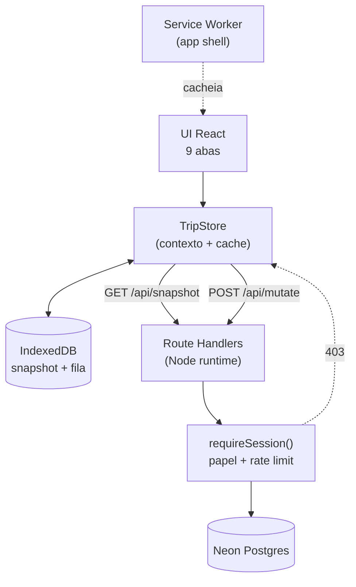

# Planejador de Viagens em Grupo — Design

**Spec**: `.specs/features/planejador-viagem/spec.md`
**Status**: Draft

---

## Architecture Overview

Três camadas, e a regra que rege todas: **o cliente nunca fala com o Postgres**. A credencial do Neon vive só no servidor; o navegador só conhece a API do próprio app.



**Leitura**: o cliente pede um snapshot inteiro, não recurso a recurso. Com 5 pessoas e uma viagem, o payload é de dezenas de KB — buscar tudo de uma vez elimina N+1, deixa o cache offline trivial e dispensa gerenciamento de estado por endpoint.

**Escrita**: toda mutação vira uma operação numa fila local. A UI aplica na hora (otimista), a fila sobe quando há rede. Offline e online usam exatamente o mesmo caminho de código — offline é só a fila demorando mais para esvaziar.

**Autorização**: um único `requireSession()` na frente de todo handler. O snapshot de um `viajante` é montado sem as tabelas financeiras — não é filtro de UI, os dados não saem do servidor.

---

## Code Reuse Analysis

Projeto novo. O "reuso" aqui é não instalar o que a plataforma já entrega.

| Necessidade | Escolha | Por que não uma dependência |
| ----------- | ------- | --------------------------- |
| Hash de PIN | `node:crypto` `scrypt` | Stdlib. bcryptjs seria uma dependência a mais para o que o Node já faz melhor. |
| Assinatura de sessão | `node:crypto` `createHmac` + cookie httpOnly | ~15 linhas. `jose`/`next-auth` trazem OAuth, adapters e JWKS que não usamos. |
| Cookies | `next/headers` `cookies()` | Já vem no App Router. |
| Geração de PDF | `window.print()` + `@media print` | Zero KB no bundle. `jspdf`/`react-pdf` custariam ~300 KB para produzir uma folha A4 estática. |
| Estilos | Tailwind v4 (já no scaffold) | Sem CSS-in-JS, sem biblioteca de componentes. |
| Cache offline | IndexedDB direto (~50 linhas) | `dexie` é 25 KB para dois object stores. |
| Service worker | Escrito à mão (~40 linhas) | `next-pwa` não acompanha o App Router de forma confiável. |
| Datas | `Intl.DateTimeFormat` | `date-fns`/`dayjs` desnecessários — não fazemos aritmética de fuso. |

**Dependências adicionadas ao scaffold:** `@neondatabase/serverless` (driver), `zod` (validação do JSON de importação, que precisa apontar o campo exato que falhou — DATA-04), `lucide-react` (ícones SVG; escrever 15 SVGs à mão é pior de manter que um import tree-shaken).

---

## Components

### `lib/db.ts`
- **Purpose**: cliente Neon único e as queries do snapshot.
- **Interfaces**: `sql` (tagged template), `getSnapshot(tripId, papel): Promise<Snapshot>`
- **Detalhe**: `getSnapshot` monta o objeto por papel. Para `viajante`, as queries de `expenses` e `expense_categories` **não são executadas** — o campo `financeiro` sai `null`.

### `lib/session.ts`
- **Purpose**: hash de PIN, cookie assinado, guarda de papel, rate limit.
- **Interfaces**:
  - `hashPin(pin: string): Promise<string>` — scrypt com salt aleatório, formato `salt:hash`
  - `verifyPin(pin: string, stored: string): Promise<boolean>` — comparação em tempo constante via `timingSafeEqual`
  - `createSession(travelerId, papel): Promise<void>` — cookie httpOnly, sameSite lax, secure, 90 dias
  - `requireSession(): Promise<Session>` — lança 401 se ausente/inválida
  - `requireAdmin(): Promise<Session>` — lança 403 se papel ≠ admin
  - `checkRate(key: string): boolean` — 10 tentativas / 5 min, janela em memória
- **Nota**: o rate limit em memória não é compartilhado entre instâncias serverless. Ver Risks.

### `lib/schema.ts`
- **Purpose**: schemas zod do JSON de importação e dos payloads de mutação.
- **Interfaces**: `TripImportSchema`, `MutationSchema`, `formatZodError(e): string` (mensagem em pt-BR apontando o caminho do campo)

### `lib/offline.ts` (cliente)
- **Purpose**: cache do snapshot e fila de escritas no IndexedDB.
- **Interfaces**: `readSnapshot()`, `writeSnapshot(s)`, `enqueue(op)`, `drainQueue()`, `queueSize()`
- **Detalhe**: dois object stores — `snapshot` (uma chave) e `queue` (autoIncrement). Todo acesso em try/catch: navegador que bloqueia IndexedDB degrada para só-online.

### `components/TripProvider.tsx`
- **Purpose**: fonte de estado da UI. Carrega do cache primeiro, revalida pela rede, aplica escritas otimistas.
- **Interfaces**: `useTrip()` → `{ snapshot, papel, online, pendentes, ultimaSync, mutate(op), recarregar() }`
- **Detalhe**: `mutate` aplica no estado local, enfileira e tenta o flush. Ouve `online`/`offline` do `window`.

### `components/tabs/*.tsx`
Nove abas, uma por arquivo: `Inicio`, `Roteiro`, `Voos`, `Hospedagem`, `Lugares`, `Checklist`, `Documentos`, `Emergencia`, `Financeiro`. Cada uma lê `useTrip()` e não conhece rede nem banco.

### `lib/derive.ts` (puro, testável)
- **Purpose**: todo cálculo derivado. Sem React, sem I/O — é aqui que mora o gate de testes.
- **Interfaces**: `diasAte(de, para)`, `faseDaViagem(hoje, partida, retorno)`, `proximoCompromisso(eventos, agora)`, `contarLugares(lugares)`, `noites(checkin, checkout)`, `progressoChecklist(itens, estado)`, `totaisFinanceiro(custos)`, `mesclarLWW(local, remoto)`

### `app/api/*`
| Rota | Método | Guarda | Faz |
| ---- | ------ | ------ | --- |
| `/api/login` | POST | rate limit | valida PIN, cria sessão |
| `/api/logout` | POST | sessão | limpa cookie |
| `/api/viajantes` | GET | público | só `id` e `nome` para a tela de seleção |
| `/api/snapshot` | GET | sessão | snapshot conforme o papel |
| `/api/mutate` | POST | sessão | aplica a fila com LWW, grava histórico |
| `/api/import` | POST | admin | valida e grava a viagem numa transação |
| `/api/export` | GET | sessão | JSON; sem financeiro se viajante |

---

## Data Models

Todas as tabelas carregam `updated_at timestamptz default now()` — é a base do last-write-wins.

```sql
trips              (id, nome, subtitulo, data_partida date, data_retorno date,
                    moeda, cor_destaque, ativo bool)
travelers          (id, trip_id, nome, papel 'admin'|'viajante', pin_hash, telefone)
itinerary_events   (id, trip_id, ocorre_em timestamp, cidade, local, titulo,
                    descricao, tipo, ancora bool, nota)
flights            (id, trip_id, companhia, numero, origem_iata, origem_cidade,
                    destino_iata, destino_cidade, parte_em timestamp,
                    chega_em timestamp, duracao_min int, localizador, nota)
flight_stops       (id, flight_id, iata, cidade, espera_min int, ordem int)
stays              (id, trip_id, nome, cidade, checkin date, checkout date,
                    endereco, link, nota)
places             (id, trip_id, cidade, pais, dias int, notas)
checklist_items    (id, trip_id, titulo, categoria,
                    escopo 'global'|'pessoal', ordem int)
checklist_state    (traveler_id, item_id, feito bool)          PK (traveler_id, item_id)
documents          (id, trip_id, titulo, valor, tipo 'texto'|'link'|'telefone', obs)
emergency_contacts (id, trip_id, titulo, telefone, detalhe, ordem int)
expense_categories (id, trip_id, nome, ordem int)
expenses           (id, trip_id, categoria_id, descricao,
                    valor_centavos int, pessoas int, pago bool)
change_log         (id, trip_id, traveler_id, entidade, entidade_id,
                    campo, de, para, criado_em timestamptz)
```

**Timestamps sem fuso.** `ocorre_em`, `parte_em` e `chega_em` são `timestamp` (sem timezone) de propósito: guardam a hora local do destino, exatamente como está no bilhete. `updated_at` e `criado_em` são `timestamptz` porque são tempo real de servidor.

**Dinheiro é `int` em centavos.** Nunca `float`, nunca `numeric` — evita o clássico `0.1 + 0.2`.

**Índices**: `trip_id` em toda tabela filha; `(trip_id, ocorre_em)` no roteiro; `(trip_id, criado_em desc)` no histórico.

---

## Protocolo de sincronização

```
Cliente                                    Servidor
   │ 1. lê IndexedDB → pinta a tela na hora
   │ 2. GET /api/snapshot ─────────────────►
   │    ◄──── { dados, server_time }
   │ 3. grava no IndexedDB
   │
   │ usuário edita (com ou sem rede)
   │ 4. aplica no estado local  (otimista)
   │ 5. enqueue({ entidade, id, campos, client_ts })
   │
   │ ao reconectar:
   │ 6. POST /api/mutate [ops] ────────────►
   │                          UPDATE … WHERE updated_at < client_ts
   │    ◄──── { aplicadas[], rejeitadas[], snapshot }
   │ 7. limpa a fila, regrava o cache
```

`rejeitadas` são operações vencidas pelo LWW: o servidor tinha versão mais nova. O cliente descarta a sua e adota a do servidor.

**Simplificação deliberada** (`ponytail:` no código de `mesclarLWW`): resolução por campo com `client_ts`, sem vetor de versão. Teto conhecido — duas pessoas editando o mesmo campo no mesmo minuto: a mais antiga perde silenciosamente. Aceitável para 5 pessoas com um admin escrevendo. Se virar problema, o caminho é vetor de versão por linha, não CRDT.

---

## Sistema visual

Denso, vibrante, alto contraste. **Três desvios explícitos** do que a busca de design sugeriu:

| Sugerido | Adotado | Por quê |
| -------- | ------- | ------- |
| Glassmorphism | Cartões sólidos, borda 1px | `backdrop-blur` sob sol direto destrói legibilidade — que é justamente o contexto de uso. |
| Fundo rosado `#FFF1F2` | Neutro `#F8FAFC` | Fundo colorido briga com as cores categóricas de cidade/categoria. |
| Padrão "Newsletter/Content First" | Painel denso | Resultado desalinhado da busca; o produto é dashboard, não landing. |

**Mantido da busca**: a direção vibrante rosa+azul, e o par **Fira Sans / Fira Code** — mono nas horas, códigos de voo, localizadores e dinheiro é o que faz uma tabela densa ficar escaneável.

**Tokens** (contraste medido, não estimado — todos passam AA sobre `#F8FAFC`):

```
fundo    #F8FAFC     texto    #0F172A  (17.06:1)
cartão   #FFFFFF     borda    #E2E8F0     secundário #475569
destaque #E11D48  ← configurável por viagem (trips.cor_destaque)
```

Cada cor categórica tem dois tons — `fill` para fundo com texto branco, `ink` para texto sobre fundo claro:

| Nome | fill (branco em cima) | ink (texto no claro) |
| ---- | --------------------- | -------------------- |
| rosa | `#E11D48` 4.70 | `#BE123C` 6.01 |
| azul | `#2563EB` 5.17 | `#2563EB` 4.94 |
| verde | `#047857` 5.48 | `#047857` 5.24 |
| âmbar | `#B45309` 5.02 | `#B45309` 4.80 |
| violeta | `#7C3AED` 5.70 | `#7C3AED` 5.45 |
| ciano | `#0E7490` 5.36 | `#0E7490` 5.12 |
| magenta | `#A21CAF` 6.32 | `#A21CAF` 6.04 |
| laranja | `#C2410C` 5.18 | `#C2410C` 4.95 |

O par rosa é o único que precisou de tons diferentes: `#E11D48` como texto dá 4.49, reprova por 0.01. Cidades e categorias recebem uma cor do ciclo pelo índice — estável entre recarregamentos.

**Densidade**: escala de espaçamento 4/8/12/16/24. Linhas de tabela com 44px de altura — denso no visual, mas sem violar o alvo de toque. Corpo 15px, rótulos 12px em maiúsculas com `letter-spacing`, números tabulares.

---

## Error Handling Strategy

| Cenário | Tratamento | O que o usuário vê |
| ------- | ---------- | ------------------ |
| Sem rede na abertura, com cache | Serve o cache | Faixa "Offline · dados de HH:MM" |
| Sem rede na abertura, sem cache | Tela de bloqueio | "Abra uma vez com internet para usar offline" |
| Neon fora do ar | Mesmo caminho do sem-rede | Idem |
| PIN errado | 401 genérico | "Nome ou PIN incorreto" |
| Rate limit estourado | 429 | "Muitas tentativas. Tente em 15 minutos." |
| Viajante chamando financeiro | 403 no servidor | Aba não existe na navegação |
| Sessão expirada com fila cheia | Fila preservada, pede login | "Entre de novo para enviar N alterações" |
| JSON de importação inválido | 400 com caminho do campo | "Erro em `voos[2].parte_em`: data inválida" |
| Falha parcial na importação | `ROLLBACK` da transação | "Nada foi importado. Corrija e tente de novo." |
| IndexedDB bloqueado | Degrada para só-online | "Modo offline indisponível neste navegador" |
| Item da fila falha 3x | Marca e segue | "1 alteração não pôde ser enviada" |

---

## Risks & Concerns

| Concern | Impact | Mitigation |
| ------- | ------ | ---------- |
| Credencial do Neon exposta no histórico da conversa | Acesso total ao banco por quem ler a transcrição | Rotacionar a senha no console do Neon após o deploy. Registrado em AD-005 e repetido na entrega. |
| Rate limit em memória não é compartilhado entre instâncias serverless | Um atacante distribuído consegue mais que 10 tentativas por janela | Com PIN de 4 dígitos e 5 nomes, o espaço é pequeno — é mitigação parcial e assumida. Se virar preocupação real: mover o contador para uma tabela no Neon. Documentado, não escondido. |
| PIN de 4 dígitos = 10.000 combinações | Força bruta é viável sem rate limit efetivo | O modelo de ameaça é "meu primo curioso", não invasor determinado. Explicitado ao usuário; migrar para 6 dígitos é uma linha. |
| LWW perde escrita concorrente | Duas edições no mesmo minuto: a mais antiga some | Aceito e marcado com `ponytail:` no código. O histórico de alterações registra ambas, então nada some sem rastro. |
| Snapshot inteiro a cada carga | Cresce linearmente com o tamanho da viagem | Dezenas de KB nesta escala. Se passar de ~1 MB, paginar por aba. Não otimizar antes disso. |
| `window.print()` varia entre navegadores | Layout do PDF pode diferir no Safari iOS | Layout de impressão simples (uma coluna, sem grid complexo), testado em Chrome e Safari. |
| Free tier do Neon suspende por inatividade | Primeira requisição após ócio demora alguns segundos | Cache local cobre — o app pinta antes da rede responder. |

---

## Tech Decisions

| Decisão | Escolha | Razão |
| ------- | ------- | ----- |
| Runtime das rotas | Node (não Edge) | `node:crypto` `scrypt` não existe no Edge runtime. |
| Migrations | `db/schema.sql` idempotente + `npm run db:push` | Uma viagem, um schema. Drizzle/Prisma seriam ferramenta demais. |
| Formato do snapshot | Objeto único por papel | Cache offline e invalidação triviais; sem N+1. |
| Hash de PIN | scrypt (stdlib) | Sem dependência, resistente a hardware dedicado. |
| Dinheiro | Inteiro em centavos | Elimina erro de ponto flutuante. |
| Fuso | `timestamp` sem timezone, hora local do destino | Converter fuso em app offline erra horário de voo. |
| Ícones | `lucide-react` | Tree-shaking; 15 SVGs à mão envelhecem pior. |
| Testes | `node:test` sobre `lib/derive.ts` | Stdlib do Node 24. Sem Jest, sem Vitest, sem config. |

> Nenhuma decisão nova de nível de projeto além das já registradas (AD-001..AD-005). O sistema visual e o protocolo de sync são locais a esta feature.
